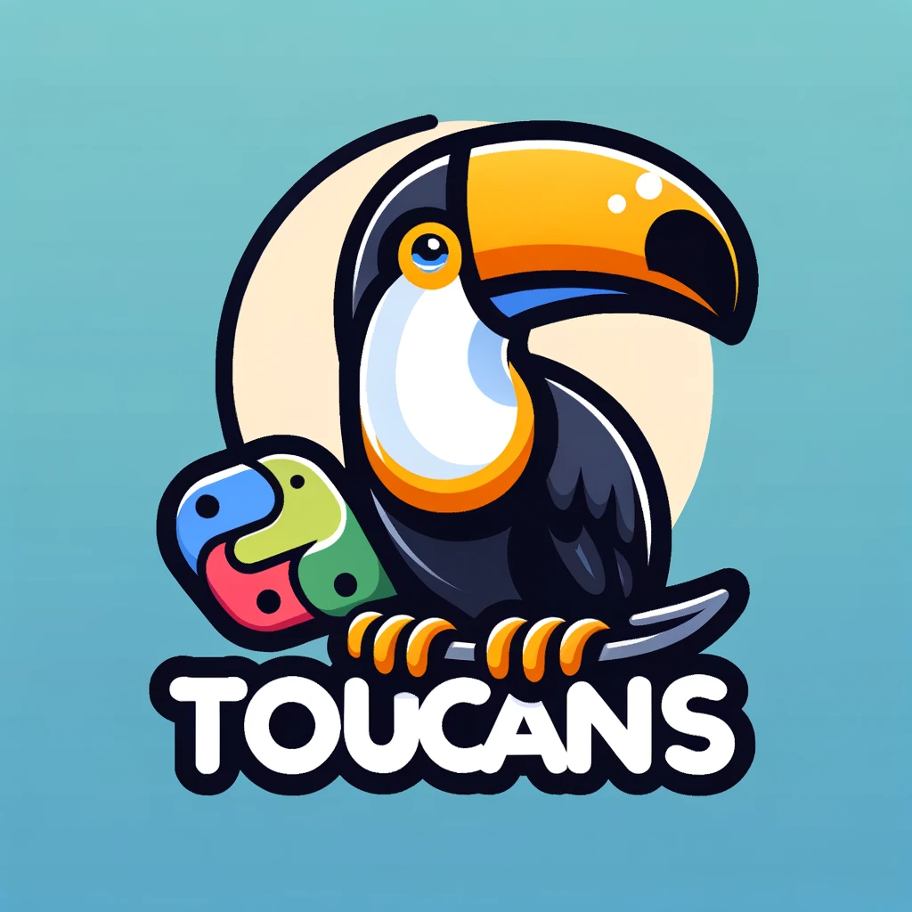

<h1 align="center">

</h1>

Toucans is a streamlined library designed for agile and flexible prompt engineering, leveraging jinja2 for dynamic prompt templating and litellm to seamlessly connect with a wide range of language model providers.

## Getting Started
### Installation
````
pip install toucans
````

### Initialize Prompt Function
To initialize a PromptFunction:

````python
from toucans import PromptFunction

prompt_func = PromptFunction(
    model="gpt-4",
    temperature=0.7,
    messages=[
        {"role": "system", "content": "You are a helpful {{ role }}."},
        {"role": "user", "content": "Answer the following question: {{ question }}"},
    ],
)
````

### Generate Completion
Generate a completion by calling the PromptFunction with the desired role and question:

````python
completion = prompt_func(
    role="Software Developer", 
    question="What is clean code?"
)
````

### Save Prompt Function
To save the initialized PromptFunction to a directory or the [toucans hub](https://github.com/kasperjunge/toucans-hub):

````python
# Push to dir (not implemented yet)
prompt_func.push_to_dir("./prompt_save_dir/")

# Push to toucans hub
prompt_func.push_to_hub("./prompt_save_dir/")
````

### Load Saved Prompt Function
To load a saved PromptFunction from a directory or the [toucans hub](https://github.com/kasperjunge/toucans-hub):

````python
# Load from dir (not implemented yet)
prompt_func = PromptFunction.from_dir("./prompt_save_dir/")

# Load from toucans hub
prompt_func = PromptFunction.from_hub("./prompt_save_dir/")
````

Loading from [Toucans Hub](https://github.com/kasperjunge/toucans-hub) requires that you run a hub and connect to it by setting the HUB_API_URL environment variable.

By following these steps, you can easily initialize, save, and load a PromptFunction for your needs.
